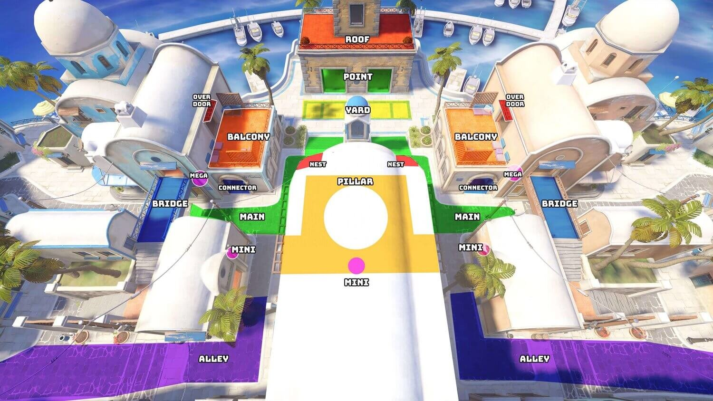

**EVALUACION COORDINACION**

**RESUMEN ENUNCIADO**

La practica trata de hacer un juego de estrategia en tiempo real entre dos ejercitos,
uno de ellos siendo el juagador o una inteligencia artificial, y el otro una inteligencia artificial.
Estas se deben desarrollar con ayuda de un mapa de influencia.

Estes dos ejercitos están compuestos por unidades e instalaciones, y están dispuesto es un mapa.
Este mapa debe seguir ciertas reglas :

- no debe haber zonas inconexas.
- no pueden haber recursos interpuestos.
- puede haber poblados graben que para atravesarlos deben ser destruidos primero.
- no se puede navegar por las dunas ni otros obstaculos, que además son estáticos e indestructibles.
- debe haber espacio incial entre todos los elementos principales del mapa (instalaciones, unidades, etc...).

Ambos bandos cuentan con un número de instalaciones e unidades con diferentes funcionalidades. Estos son:

- La instalación base: se le puede solicitar crear unidades de uno de los 3 tipos posibles a cambio de dinero (solaris).
  Tienen 100 puntos de vida y si se destruyen todas se pierde la partida.
- La instalación de procesamiento: aporta dinero al jugador a cambio de la especia extraida. Funciona de forma automática, 
  cuando recibe la especia, y para destruirlos deben asestarles 50 puntos de daño.
- La unidad extractora: extrae especia de los campos. Se le puede solicitar que se mueva a cierta posición.
  En contacto con un campo extraeran especia, la llevaran a la instalación de procesamiento y volverán al campo
  en un bucle hasta que se le mande una neva orden. En cada obtienen la especia equivalente a 1000 solaris,
  su fabricación cuesta 10000 solaris, tienen 10 puntos de vida y cada jugador puede tener como máximo 5.
- La unidad exploradora: unidad de combate, se mmueve a la posición indicada, si en esta no hay nada 
  permanece inmóvil, si hay instalaciones o unidades enemigas las ataca, al igula que a las torretas y el poblado graben
  que se encuentren en su camino. Si le atacan contratacan y si huyen de él les persigue. Causa 1 de daño por medio segundo,
  2DPS, tienen 5 de vida, y cuestan 15000. puede haber 30 como máximo.
- La unidad destructora: es una unidad mejorada de la exploradora que se mueve más lento a cambio de más poder y resistencia.
No persiguena las unidades que huyen de él y no contesta a las agresiones, centrandose en su objetivo a abatir. Causan 10 puntos
de daño cada 2 segundos, 5DPS, tienen 20 de vida, cuestan 30000 solaris y el máximo de unidades es 10.

Contenidos requeridos para la práctica:

Se ha de implementar un mapa de influencia para la organización de un bando, dando ordenes a sus unidades e instalaciones,
con un esquema de división de baldosas que permita conocer el terreno. Este mapa de estar dibujado sobre el escenario, y se deben 
usar las teclas F, G y H para mostrar la influencia de cada bando, los Fremen, los Graben y los Harkonnen respectivamente. 
 
Se deberá crear una variante del esceneraio, por lo menos.

Se debe mostrar el avance del mapa de influencia en constante actualización según la táctica que se siga.

Las unidades deben cumplir un mínimo de eficiencia, evitando que estas queden inactivas  o se bloqueen, 
además de una iniciativa en ataque, y una reacción en defensa.

Demostrar competencia de la inteligencia poniendole a prueba en diferentes situaciones.

Contadores de unidades activas, derrotadas, instalaciones activas, destruidas y el tiempo de juego, mostrandose por pantalla.

Restricciones

- no modificar el codigo base del proyecto.
- no utilizar código ni plugins ajenos a los aportados.
- evitar el uso de recursos audiovisuales pesados o ajenos.
   
Extras:

- añadir sonidos y efectos visuales.
- mejorar la interfaz y el control humano, arrancando con un menu de configuración de contrincantes y condiciones de batalla.
- mejorar el movimiento y la navegación.
- añadir gusanos de tierra que dañan las instalaciones al colisionar con ellas.
- mejorar el controlador humano con feedbacky, y mejorar la precisión de los detinos.
- localizar puntos de ruta tácticos para mejorar la nevgación.
- realizar un analisis táctico diferente a mapas de infleuncia.
- coordinar acciones de unidades, realizando jugadas predefinidas.
- Extender inteligencia para batallas N contra N.
    

**PUNTO DE PARTIDA**

El juego trata de dos bandos en un campo de batalla(Harkonnen y Fremen), que será lo que represente nuestra escena. El escenario es un mapa con dunas y poblados como obstáculos.
Además las tropas de cada uno navegarán por él y tendrán sus instalaciones dispuestan en el mapa.
Elementos de ambos bandos:
    -Base Facility: Edificio base del equipo. En él se generan las nuevas tropas con el script "BaseFacilities". Si se destruye(20 de vida) pierde la partida.
    -Processing Facility: Edificio en el que los extractores depositan el recurso obtenido. Tiene 2 script, "Processing Facility", que guarda la posición en la que las
        extractoras pueden dejar la carga, y "Limited Acces", para bloquear el acceso de más de un extractor a la vez y dar posiciones en las que esperen las demás que quieran descargar.
    -Exploration Unit: Soldados básicos que exploran y atacan, aunque con menos daño que los destructores. Son más rápidas y proactivas gracias al script "ExplorationUnit", que lo mueve
        combinado con el árbol de comportamiento Combat, que selecciona un objetivo al que atacar y le persigue hasta lograrlo. Cambia de objetivo si en este proceso se ve amenzado por
        otra unidad. En caso de no tener objetivo irá a por instalaciones cercanas.
    -Destruction Unit: Combatiente más fuerte y lento, que buscará un objetivo y se centrará en él hasta que lo elimine. Esto se realiza en el script "DestructionUnit" y con el árbol de
        comportamiento de ataque, dejando siempre la amenaza a false, al contrario que los exploradores.
    -Extraction Unit: Unidad extractora de mineral que al llevar al Processing convierte en dinero. Usa el script "Extraction Unit" y el árbol de comportamientos Extraction, el cual
        le lleva al objetivo que se le haya mandado, en caso de no tener y estar cargado irá a dejar la carga a la estación de procesado más cercana. Si no lleva carga irá a extraer
        a la zona de mineral más cercana.
Elementos del mapa:
    -Dunas: Objetos estáticos que bloquean el movimiento de tropas e impiden que pasen por ahí.
    -MelangeFields: Campos de recurso, a los que accederán las extractoras a obtenerlo.
    -Cámaras: La central que visualiza todo el mapa y una en cada bando.
    -GrabenCamp: Campamentos neutros que podrán ser atacados por los dos bandos:
        -GrabenVillage: Campamento central que ordena, mediante el script "Village", que controla la distancia a la que están las tropas atacantes y cuando atacarlas.
        -GrabenTower: Torretas neutrales que atacan a las tropas que se acercan a ellas mediante el script "Tower" y el árbol de comportamiento Defense, que ordena atacar al objetivo
            hasta eliminarlo.
ScenarioManager: Controla todos los elementos neutrales del mapa activos, haciendo que las tropas puedan responder a las diversas situaciones tácticas.
GameManager: A partir del script "RTSGameManager" controla toda la información del juego, los controladores, el coste de cada unidad y su prefab asociado. Inicia el juego y
    reacciona a acciones de las unidades.

El script "Facility" es una clase abstracta para todas las facilities que haya en el juego, detecta los golpes y elimina el edificio si este es destruido.
Todas las tropas y edificios constan del componente "Health", que controla la vida que tiene y recibe daño.
El script "Proyectile" es el que llevan las balas generadas por las torretas.
Además de todos estos comportamientos, existen scripts para que el jugador pueda controlar a uno de los bandos de forma controlada o random.

La carpeta dentro de scripts de comportamientos contiene todas las acciones que utilizan los distinots árboles de comportamiento.

**COMPORTAMIENTOS A AÑADIR**

Implementaremos un mapa de influencia basandonos en el algoritmo MapFlooding con la siguiente estructura:

    # The strength function has this format.
    2 function strengthFunction(city: City, location: Location) -> float
    3
    4 # This structure is used to keep track of the information we need for
    5 # each location.
    6 class LocationRecord:
    7 location: Location
    8 nearestCity: City
    9 strength: float
    10
    11 function mapfloodDijkstra(map: Map,cities: City[], strengthThreshold: float, strengthFunction: function) -> LocationRecord[]:
    16
    17 # Initialize the open and closed lists.
    18 open = new PathfindingList()
    19 closed = new PathfindingList()
    20
    21 # Initialize the record for the start nodes.
    22 for city in cities:
    23 startRecord = new LocationRecord()
    24 startRecord.location = city.getLocation()
    25 startRecord.city = city
    26 startRecord.strength = city.getStrength()
    27 open += startRecord
    28
    29 # Iterate through processing each node.
    30 while open:
    31 # Find the largest element in the open list.
    32 current = open.largestElement()
    33
    34 # Get its neighboring locations.
    35 locations = map.getNeighbors(current.location)
    36
    37 # Loop through each location in turn.
    38 for location in locations:
    39 # Get the strength for the end node.
    40 strength = strengthFunction(current.city, location)
    41
    42 # Skip if the strength is too low.
    43 if strength < strengthThreshold:
    6.2 Tactical Analyses 531
    44 continue
    45
    46 # .. or if closed and we’ve found a worse route.
    47 else if closed.contains(location):
    48 # Find the record in the closed list.
    49 neighborRecord = closed.find(location)
    50 if neighborRecord.city != current.city and
    51 neighborRecord.strength < strength:
    52 continue
    53
    54 # .. or if it is open and we’ve found a worse
    55 # route.
    56 else if open.contains(location):
    57 # Find the record in the open list.
    58 neighborRecord = open.find(location)
    59 if neighborRecord.strength < strength:
    60 continue
    61
    62 # Otherwise we know we’ve got an unvisited
    63 # node, so make a record for it.
    64 else:
    65 neighborRecord = new NodeRecord()
    66 neighborRecord.location = location
    67
    68 # We’re here if we need to update the node
    69 # Update the cost and connection.
    70 neighborRecord.city = current.city
    71 neighborRecord.strength = strength
    72
    73 # And add it to the open list.
    74 if not open.contains(location):
    75 open += neighborRecord
    76
    77 # We’ve finished looking at the neighbors for the current
    78 # node, so add it to the closed list and remove it from the
    79 # open list.
    80 open -= current
    81 closed += current
    82
    83 # The closed list now contains all the locations that belong to
    84 # any city, along with the city they belong to.
    85 return closed

- actualizaremos el gameManager para añadir el input de las teclas F, G y H, que muestren la zona de 
influencia de cada bando, además de los contadores de métricas, que se mostrarán por pantalla.

- un nuevo escenario basado en el siguiente mapa:

    

**IMPLEMENTACIÓN FINAL**

Video YouTube: 
    